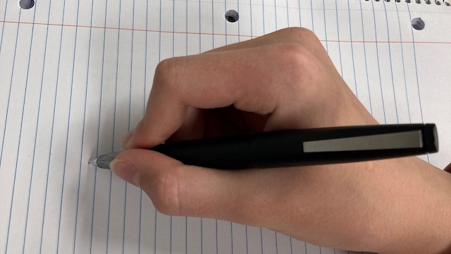

<div align="center"></div>
<h1 align="center">Matthew's Fountain Pens with JavaScript</h1>
<p align="center"><strong>This branch represents the work I learned and applied as a result of taking CWB 2005 Client-Side Scripting with JavaScript.</strong>
<br/>
<h2>About</h2>
For this class I received approval to submit a final by enhancing my Fountain Pens site with new JavaScript capabilities.      

<h2>Technologies</h2>
For CWB 2005 Client-Side Scripting, we focused on learning JavaScript both with embedded and external scripts.

<h2>Goal and requirements</h2>

Requirements for this project is to incorporate a number of JavaScript elements into a personally developed website along with the following:
<ul>
<li>Loading a json document</li>
<li>Filtering data</li>
<li>Using a jQuery component</li>
<li>Applying local storage</li>
<li>Consume an external api</li>
</ul>

<h2>Skills acquired</h2>

- Google Maps API Account Management
- Working with Multimedia in Google Maps KML
- Applying Google Maps InfoWindow
- Creating Map API markers from a custom json document
- Read and Write map data to and from local storage
- Show/Hide html with jQuery accordion controls 

<h2>Project Status</h2>
This project is whole as submitted for my final. 

<h2>Installation</h2>

1. Download this project as zip and extract it
2. Within the console (Terminal Window), make sure PHP is installed, then open the project root folder and run:
   ```
    php -S localhost:3000
   ```
3. In the browser, navigate to [http://localhost:3000](http://localhost:3000)

<h2>Future areas to focus on</h2>

As this was a beginner course in JavaScript, I did not have the opportunity to explore building my own responsive navigation menu which I hoped for. This is still a goal. However I did find a way to use JavaScript to automatically set an active class to the active menu item page dynamically. I am pretty happy with where the JavaScript implementation ended up. 
