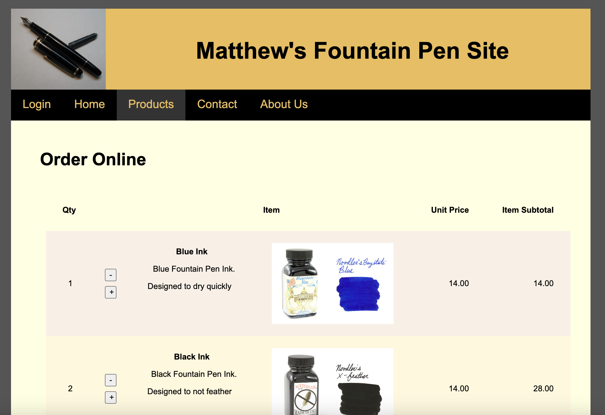

<h1 align="center">Matthew's Fountain Pens with PHP</h1>
<p align="center"><strong>This branch represents the work I learned and applied as a result of taking CWB 2008 Web Application Development: DevTools (PHP).</strong>
<br/>
<div align="center"></div>

<h2>About</h2>
For this class I received approval to submit a final by enhancing my Fountain Pens site with PHP.        

<h2>Technologies</h2>
For CWB 2008, we focused on learning PHP both with embedded and external scripts, while also incorporating databases with SQLite3 and MySQL.

<h2>Goal and requirements</h2>
The assignment for the final was to create an original web site from scratch that utilizes PHP, applying everything learned within the course.  
Requirements for this project is to incorporate the following:
<ul>
<li>Embed common header and footer php documents into each page</li>
<li>Use PHP to dynamically set the active nav list item</li>
<li>Simulate a login with cookies</li>
<li>Read content from a form and save submittals to file</li>
<li>Read products from csv and populate DB table with PHP</li>
<li>Establish a shopping page with a cart & submit, saving each order to file</li>
</ul>

<h2>Project Status</h2>
The project final requirements were met. However there is more to be done, like establishing real online orders with customer information, payments, and utilizing the database for order management. Additional enhancements would include a modernized interface for login, profile, and account management. 

<h2>Installation</h2>

1. Download this project as zip and extract it
2. Within the console (Terminal Window), make sure PHP is installed, then change directory to the project root folder and run:
   ```
    php -S localhost:3000
   ```
3. In the browser, navigate to [http://localhost:3000](http://localhost:3000)
